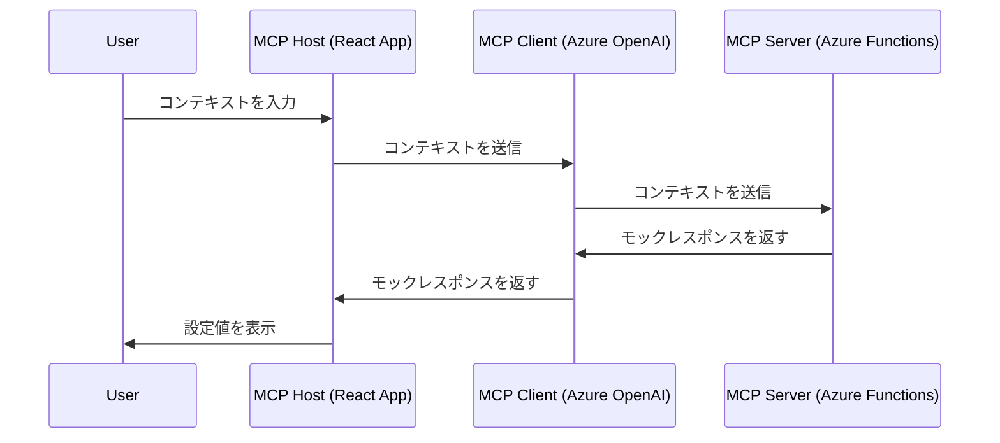

# MCP対応 デバイス設定提案ツール
このリポジトリは、Model Context Protocol (MCP) に準拠した、文脈に応じてデバイス設定を提案するツールのデモ実装です。

## 背景と構成方針
- 理想構成：デバイス自体がMCP Hostとして動作し、最適な設定をLanguage Model＋外部ツールで決定
- 制約：現時点ではMCP Hostの条件を満たすことができないデバイスも存在する
- 本PoCの構成：
  - MCP HostをAzure Static Web Apps上のWebアプリ（Reactベース）として実装
  - MCP ClientではAzure OpenAI Serviceを利用
  - MCP ServerはAzure Functions上で稼働

## アーキテクチャ概要
以下は、このデモシステムのアーキテクチャ概要です。



## ローカルでの実行方法

### フロントエンド (React App)
1. リポジトリをクローンします。
   ```sh
   git clone https://github.com/rukasakurai/mcp-device-settings-demo.git
   cd mcp-device-settings-demo/frontend
   ```
2. 依存関係をインストールします。
   ```sh
   npm install
   ```
3. 開発サーバーを起動します。
   ```sh
   npm start
   ```
4. ブラウザで `http://localhost:3000` を開きます。

### サーバー (Azure Functions)
1. Azure Functions Core Tools をインストールします。
   ```sh
   npm install -g azure-functions-core-tools@3
   ```
2. サーバーディレクトリに移動します。
   ```sh
   cd ../server
   ```
3. 依存関係をインストールします。
   ```sh
   npm install
   ```
4. Azure Functions を起動します。
   ```sh
   func start
   ```

## Azure へのデプロイ方法

### GitHub Actions を使用したデプロイ
1. リポジトリをフォークし、GitHub Actions を有効にします。
2. `.github/workflows/ci-cd.yml` ファイルを設定します。
3. GitHub Secrets に Azure の資格情報を追加します。
4. コミットをプッシュすると、自動的にデプロイが開始されます。

### Azure Developer CLI (`azd`) を使用したデプロイ
1. Azure Developer CLI をインストールします。
   ```sh
   curl -fsSL https://aka.ms/install-azd.sh | bash
   ```
2. プロジェクトディレクトリに移動します。
   ```sh
   cd mcp-device-settings-demo
   ```
3. インフラストラクチャをデプロイします。
   ```sh
   azd up
   ```

## アプリの実行方法
1. フロントエンドとサーバーが起動していることを確認します。
2. ブラウザで `http://localhost:3000` を開き、コンテキストを入力します。
3. 設定値が表示されることを確認します。

## UI のイメージ

